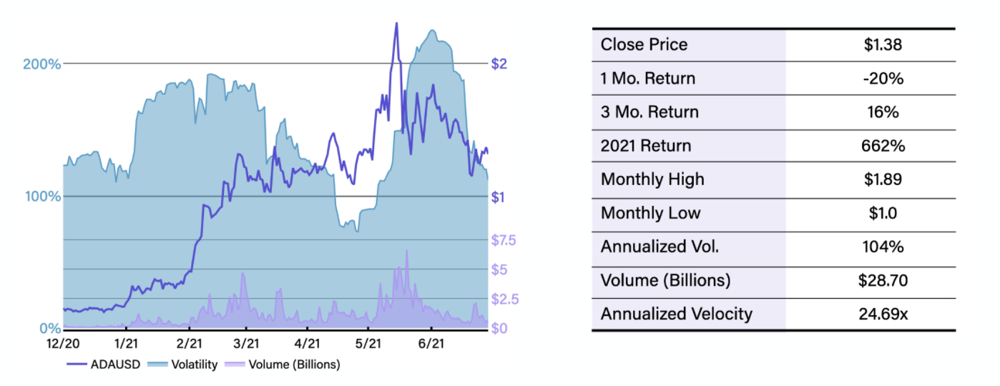
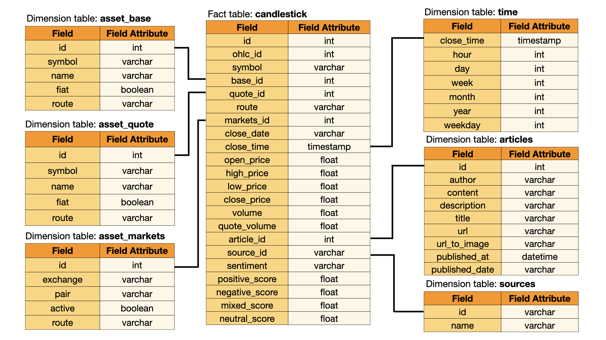
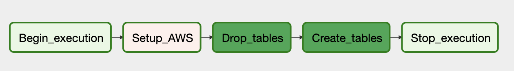
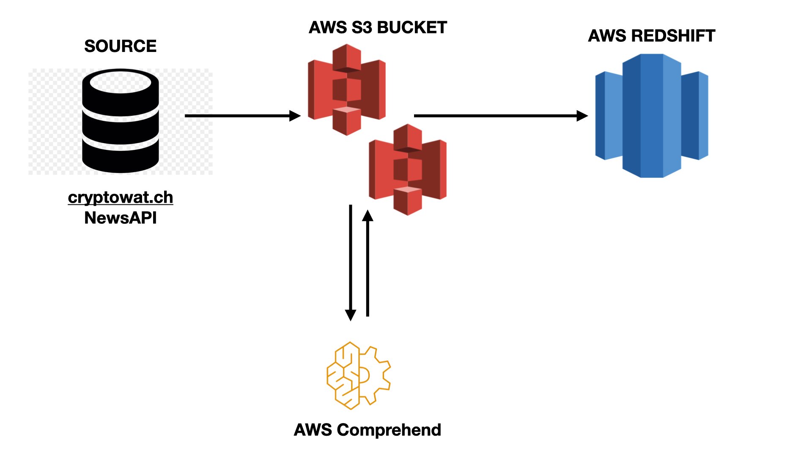
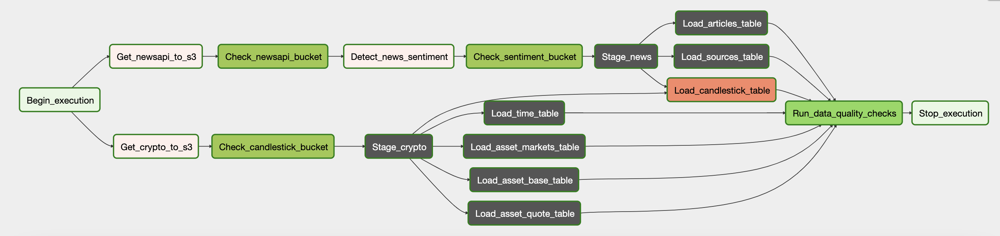

 [![Contributors][contributors-shield]][contributors-url] [![Stargazers][stars-shield]][stars-url] [![Forks][forks-shield]][forks-url] [![Issues][issues-shield]][issues-url] [![MIT License][license-shield]][license-url] [![LinkedIn][linkedin-shield]][linkedin-url]

<br />
<p align="center">
    <a href="https://github.com/najuzilu/crypto">
        
    </a>
    <h3 align="center">Monthly Cryptoasset Market Report & Outlook</h3>
</p>


## Project Description

In this project, we monitor market performance of main cryptoassets by building data warehouse ETL pipelines that combine daily [Cryptowatch](http://cryptowat.ch/) and [NewsAPI](https://newsapi.org/) data to produce monthly recap and outlook reports on main crypto coins such as Bitcoin, Ethereum, Cardano, and Dogecoin. The crypto market is volatile for various reasons, including media coverage. Detecting news sentiment of cryptoassets could provide insights into future price and volume fluctuations.

### Scope the Project

We will utilize APIs to query data from [Cryptowatch](http://cryptowat.ch/) and [NewsAPI](https://newsapi.org/). Both sources, can provide real-time data; however, in this project, we are interested in the analyzing last month's market performance. First, we will retrieve all the cryptoasset data for the last month using [Cryptowatch](http://cryptowat.ch/) REST API. Next, we will retrieve all articles from last month whose category or title match any of the main cryptoassets. Once both data extractions been successful in the designated S3 bucket, we will utilize Amazon Comprehend to process the sentiment analysis from the collection of articles. Amazon Comprehend is a NLP service provided by AWS to extract sentiment, key phases, and entities for further analysis. Finally, we will populate two main staging tables in Redshift by copying data from the S3 bucket, which will in turn populate the fact and dimension tables.

This process has been automated and scheduled through Apache Airflow, so that on the first day of every month, the scheduler will trigger a data retrieval process of last month's crypto market and news article data.


### Gather Data

* **Financial Data**: [Cryptowatch](http://cryptowat.ch/) provides live price charts and trading for top cryptocurrencies like Bitcoin (BTC) and Ethereum (ETH) on various exchanges. We use their market data REST API to extract daily OHLC Candlestick data. This data includes `CloseTime`, `OpenPrice`, `HighPrice`, `LowPrice`, `ClosePrice`, `Volume`, and `QuoteVolume` for all market exchanges and asset pairs.
* **Semi-structured Text Data**: [NewsAPI](https://newsapi.org/) provides search results for curren and historic news articles published by over 80,000 worldwide sources. We find all articles written in English which contain specific keywords.

The report will display stylized facts for all cryptocurrencies. Below is an example of the Bitcoin (BTCUSD) market recap.



### Data Model & ERD

We have defined the Star Database Schema with fact and dimension schema for this project as shown below. the fact table contains all the facts associated with the markets and news articles. The other six dimension tables have been normalized. This model enables a minimum number of queries and fast read queries.




[Note](#): Not shown in the ERD are the two staging tables - `staging_crypto` and `staging_news` - which are used to populate the fact and dimension tables in Redshift.

## ETL Pipeline

### DAG Operations

We use Apache Airflow DAG to execute the ETL pipeline. Two DAGs have been created. The `setup_aws_dag` goes through the following steps sequentially:
1. Create or empty the S3 bucket.
2. Create the Redshift cluster with appropriate role/policy and retrieve cluster endpoint.
3. Setup Airflow connections to AWS and Redshift cluster.
4. Delete any existing tables in Redshift.
5. Finally, create the staging, fact, and dimension tables.



This dag is not scheduled and should only be run once to setup the AWS resources.

The `etl_pipeline` dag is set up to execute the first day of every month following these steps:
1. Start execution as scheduled.
2. Retrieve data and upload to S3 bucket.
3. Perform check to make sure S3 bucket has objects.
4. Perform sentiment analysis on text data using Amazon Comprehend.
5. Perform check to make sure sentiment analysis was successful.
6. Load data from S3 to Redshift staging tables. Then, check staging tables have observations.
7. Use staging tables to populate the fact and dimension data.
8. End execution.

<!--  -->



## Getting Started

Clone this repository

```bash
git clone https://github.com/najuzilu/crypto.git
```

## Project Steps


## Tools and Technologies

* Python=3.6
* AWS Redshift
    Amazon Redshift is a fast, simple, cost-effective cloud data warehousing service. Redshift is designed for large scale data storage and analysis, and it is used to perform large scale database migrations. Redshift connects to SQL-based clients and BI tools, allowing for real-time access to data. We utilize Redshift to store the dynamic datasets.
* AWS S3
    Amazon Simple Storage Service (Amazon S3) is an object storage service that you can use to store and retrieve any amount of data, at nay time, from anywhere. Ti provides access to highly scalable, reliable, fast, and inexpensive data storage infrastructure. We use Amazon S3 to store the data retrieved through REST APIs and the text sentiment analysis performed through Amazon Comprehend.
* Apache Airflow=1.20.2
    Apache Airflow is an open-source scheduler to manage your jobs: to organize, execute, and monitor your workflows so that they work seamlessly. It provides many plug-and-play operators that are ready to execute your tasks on Amazon Web Services and many other third-party services. We use Airflow to create our two workflows as directed acyclic graphs (DAGs). The Airflow scheduler executes our tasks on an array of workers following the specified dependencies. We monitor, schedule, and manage the workflow via the robust UI.
* AWS Comprehend
    Amazon Comprehend is a natural language processing (NLP) service which uses machine learning to uncover information in unstructured data. The service can identify critical elements in data. Amazon Comprehend can process the text to extract key phrases, entities, and sentiment for further analysis. We utilize Amazon Comprehend to process text to extract news sentiment.

## Project Steps

1. Use `dwh_example.cfg` to create and populate a `dwh.cfg` file with the relevant information.
2. Run `./start.sh` to start the Airflow WebUI.
3. Trigger `setup_aws_dag` dag to setup all AWS resources.
4. If `setup_aws_dag` was successful, trigger `etl_pipeline`. [Note:](#) This specific dag prevents Airflow from backfilling. This is done to avoid charges/limitations for other users when using [Cryptowatch](http://cryptowat.ch/) and [NewsAPI](https://newsapi.org/) API key.

## Scenarios

### Increase in Data by 100x
Through AWS services, we can easily scale our resources either vertically or horizontally. If, for instance, we wanted to retrieve hourly candlestick data in addition to daily data, we could easily setup a new S3 bucket and increase the number of nodes on the Redshift cluster. Furthermore, partitioning the data in S3 buckets would make it easier to run DAG tasks in parallel.

### Pipeline Scheduled Daily
Scheduling the pipeline to run every day at a specific hour will **not** be an issue, since the `etl_pipeline` dag does not have to create/terminate clusters, and populate/empty s3 buckets.


### Database User Increase by 100x Simultaneously
Working on the cloud means that we can provide access to users easily; we would need more resources (CPU) to handle the increase in users.

<!-- ## Room for Improvement -->
<!-- Links -->

[contributors-shield]: https://img.shields.io/github/contributors/najuzilu/crypto.svg?style=flat-square
[contributors-url]: https://github.com/najuzilu/crypto/graphs/contributors
[forks-shield]: https://img.shields.io/github/forks/najuzilu/crypto.svg?style=flat-square
[forks-url]: https://github.com/najuzilu/crypto/network/members
[stars-shield]: https://img.shields.io/github/stars/najuzilu/crypto.svg?style=flat-square
[stars-url]: https://github.com/najuzilu/crypto/stargazers
[issues-shield]: https://img.shields.io/github/issues/najuzilu/crypto.svg?style=flat-square
[issues-url]: https://github.com/najuzilu/crypto/issues
[license-shield]: https://img.shields.io/badge/License-MIT-yellow.svg
[license-url]: https://github.com/najuzilu/crypto/blob/master/LICENSE
[linkedin-shield]: https://img.shields.io/badge/-LinkedIn-black.svg?style=flat-square&logo=linkedin&colorB=555
[linkedin-url]: https://www.linkedin.com/in/yuna-luzi/
